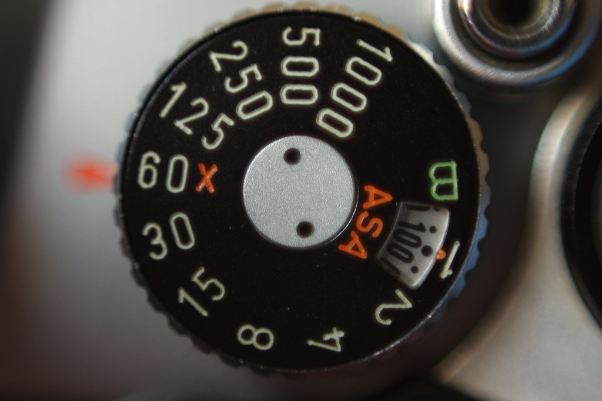
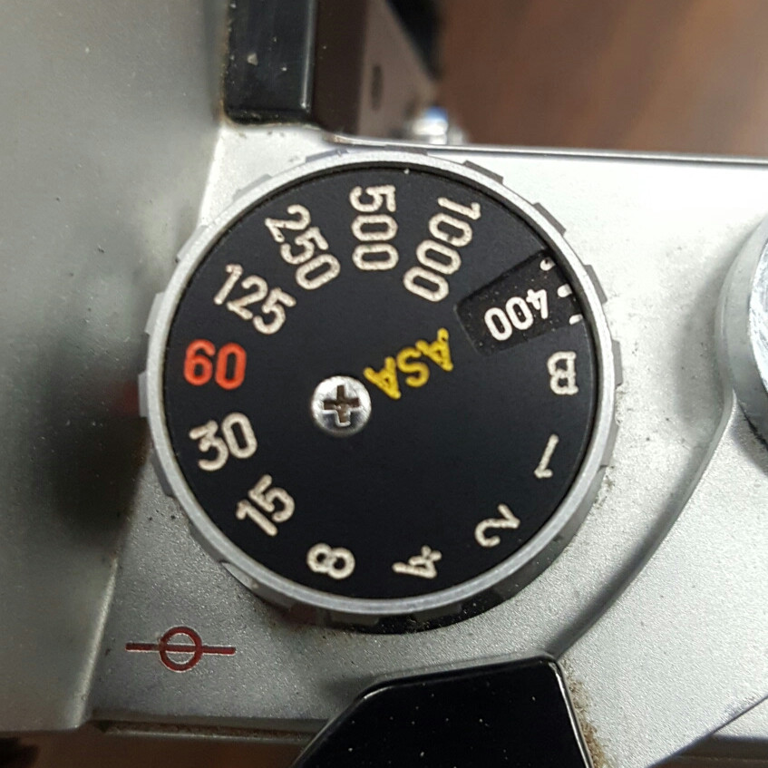
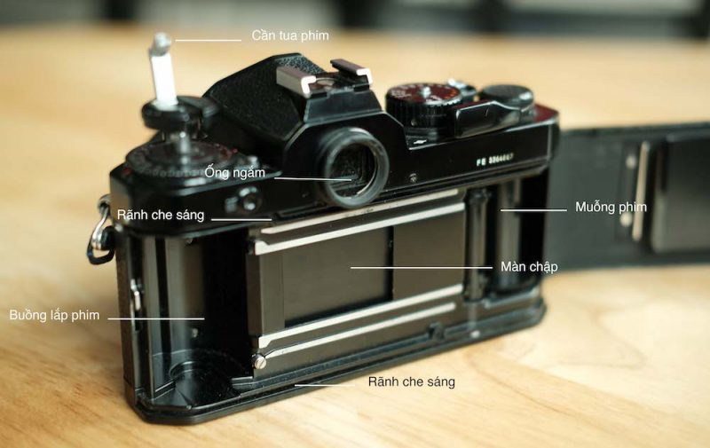
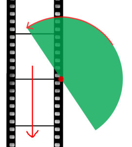

Đối với máy phim thì có muôn vàn sự lựa chọn như là: SLR, rangefinders, point n shoot,... Với vài mẹo nhỏ dưới đây mình hy vọng có thể giúp được mọi người tìm được một chiếc máy phim đúng như mong muốn của mọi người để bắt đầu hành trình chơi phim thú vị này.

Từ kinh nghiệm nhiều lần đi mua, bán các dòng máy từ máy phim tới máy số thì mình đúc kết được một số mẹo sau để kiểm tra máy trước khi mua. 
### 1. Kiểm tra các bộ phận dễ rơi rớt.
Kiểm tra các thành phần như nắp pin, seal của nắp buồng phim sẽ vô cùng cần thiết để đảm bảo quá trình trải nghiệm của mọi người được hoàn hảo nhất nhé. Sẽ có những miếng seal bằng cao su trong nắp đậy buồng phim để không bị hở sáng. Vì khi hở sáng nghĩa là sẽ có ánh sáng không mong muốn lọt vô buồng phim, dẫn tới tình trạng cháy phim.

### 2. Kiểm tra kính
Kiểm tra xem ống kính có bị mốc, xước, bụi hay không. Vì những yếu tố trên sẽ ảnh hưởng rất nhiều đến ảnh chụp. Cách đơn giản có thể kiểm tra chính là soi đèn flash vào trong ống kính, các vết xước, bụi sẽ phản chiếu ánh sáng giúp ta kiểm tra các vấn đề về lens dễ dàng hơn.

### 3. Kiểm tra vòng lấy nét, vòng chỉnh khẩu độ.
Xoay thử vòng lấy nét hết các khoảng cách và nó phải mượt mà, không bị rích, nặng khi xoay. Trong trường hợp mua lens zoom thì vòng zoom cũng phải thò ra thụt vào trơn mướt. Đối với vòng chỉ khẩu độ thì chú ý độ nẩy của vòng khẩu mỗi khi ta xoay, cụ thể là sẽ vang lên một tiếng "slack" nhỏ. Khi xoay khẩu thì nhìn vào trong ống kính xem các lá khẩu có khép/mở theo đúng những gì ta vặn hay không.

### 4. Kiểm tra các núm xoay trên thân máy
Tùy theo máy có những núm vặn nào mà tiếng hành kiểm tra như: núm chỉnh tốc độ chụp, núp chỉnh ISO,... Các núm vặn không bị kẹt là OK rồi đó.

### 5. Kiểm tra tốc độ màn trập
Máy phim đa phần đều có tuổi thọ đã rất cao nên màn trập là thứ sẽ hỏng đầu tiên đối với các máy lâu đời. Thường thì màn trập sẽ bị kẹt hoặc không mượt vì thiếu bôi trơn. Đối với vấn đề này thì nên kiểm tra bằng cách chụp thử ở tốc độ thấp: 1s, 1/2s, 1/4s,... chụp từ từ đến tốc tối đa của máy. Nếu như màn trập đóng mở đúng với thời gian thì ổn áp.

Tiếp theo là ở tốc độ cao của máy (tầm 1/1000 trở lên).
+ Mở nắp buồng phim
+ Cầm máy hướng lên trời (đừng hướng trực tiếp về mặt trời nhen)
+ Chụp thử 1 shot
=> Nếu trên màn trập chớp một vòng tròn đầy đủ thì màn trập hoạt động ổn định. Còn chỉ hiện nửa vòng tròn thì màn trập có vấn đề dẫn đến ra hình sẽ bị đen một nửa.

### 6. Kiểm tra đo sáng.
Phải lắp lens vô cho phần này nhen và chắc chắn rằng là máy có đo sáng hoặc chưa hết pin đo sáng. Hướng máy ảnh từ vùng sáng thiệt là sáng tới vùng tối thiệt là tối. Theo dõi kim đo sáng có thay đổi không, tiếp theo, cân chỉnh các thông số để kim đo sáng cân bằng. Tránh những hậu quả đo sáng sai dẫn đến hình ra đen xì hay cháy sáng.

### 7.  Kết
Đó là một ít kinh nghiệm mình tích cóp được trong một khoảng thời gian 3-4 năm chơi máy ảnh của mình. Nếu như có thắc mắc hay góp ý gì thêm về bài viết đừng ngần ngại direct mình nhen.