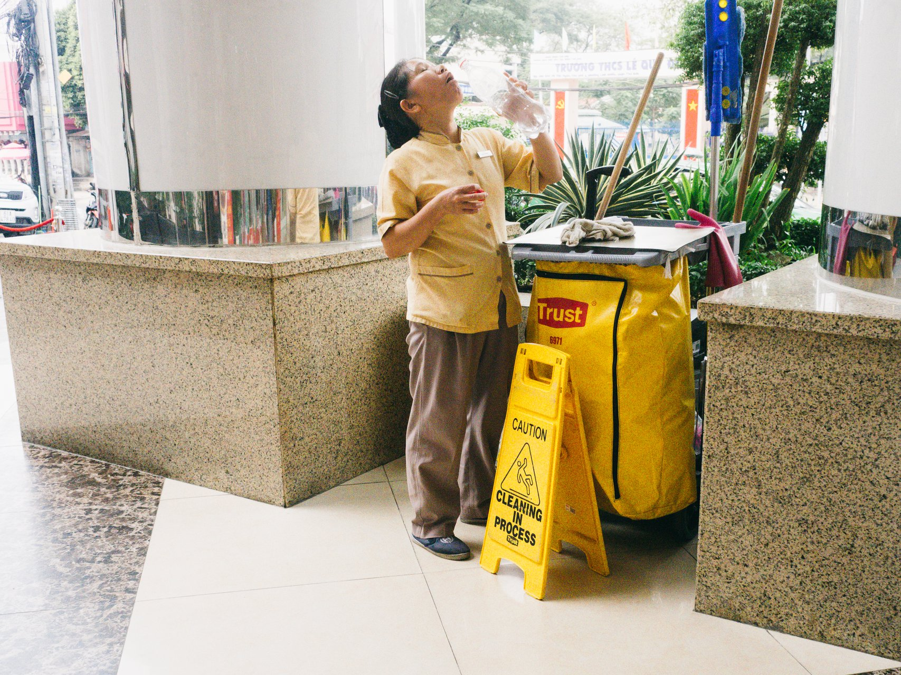
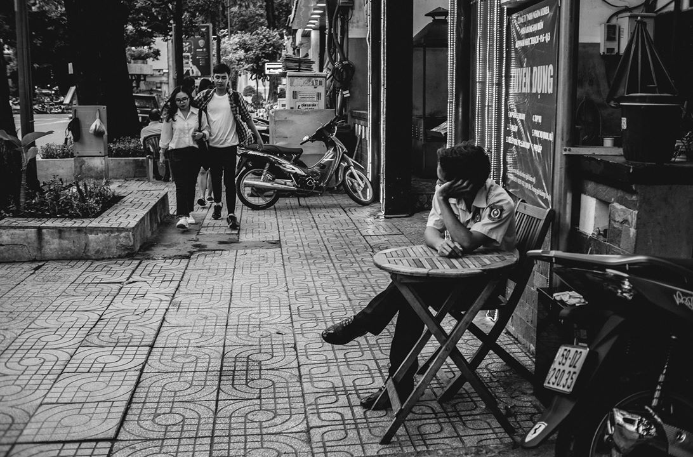
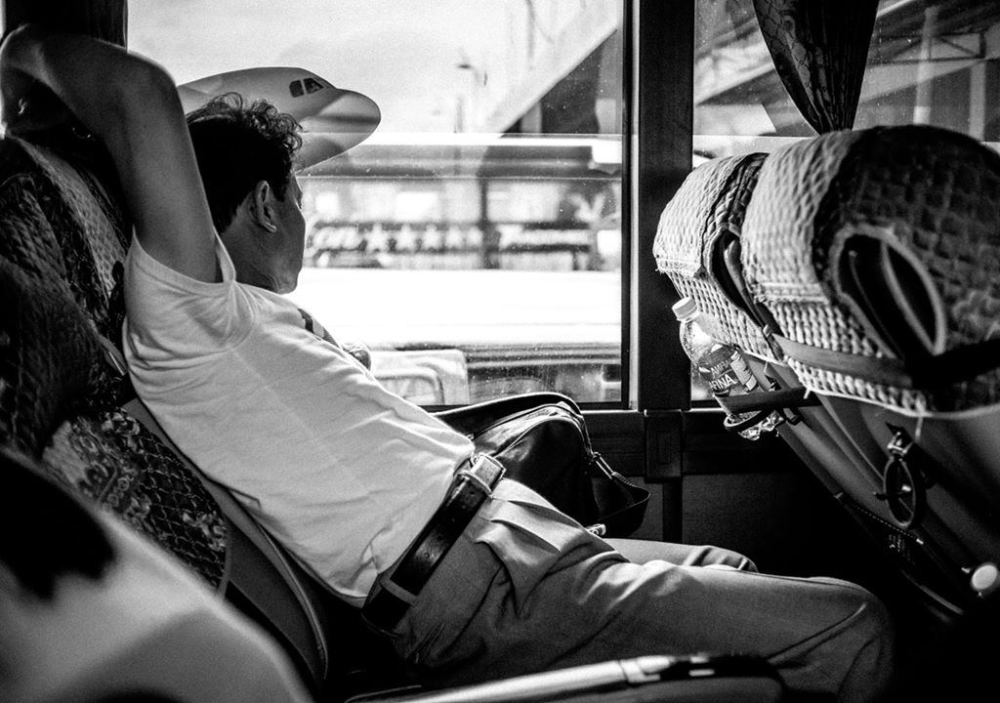
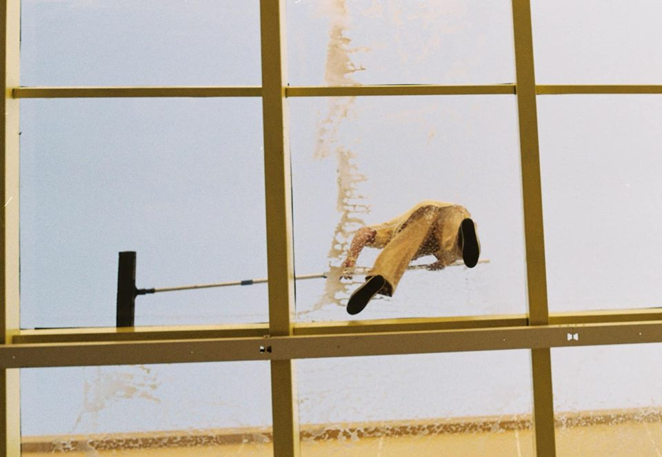

Khi bước chân ra đường để chụp ảnh đường phố, nhiều người vẫn luôn e ngại hay lo lắng về việc đối tượng sẽ phản ứng tiêu cực lại với mình. Tuy nhiên đó là điều tất yếu khi bạn chụp ảnh đường phố, kể cả những nhiếp ảnh gia nổi tiếng, họ cũng cũng gặp phải các tình huống tương tự. 

Từ kinh nghiệm bản thân và học hỏi từ các nhiếp ảnh gia đi trước thì mình thấy có 2 cách chính để tiếp cận đối tượng khi chụp ảnh đường phố, đó là:  
### 1. Xin phép rồi chụp
Mình thấy cách này có lẽ mang lại cảm giác thoải mái cho cả hai, mà nhiều khi lại có câu chuyện hay (dạng ảnh tựa kiểu Humans of New York). Tuy nhiên những bức ảnh mang cảm giác "an toàn" và không thu hút người xem (phần câu chuyện có thể là phần đắt giá nhất), chủ yếu áp dụng cho ảnh chân dung đường phố.  

### 2. Bắt khoảnh khắc
Đây là cách mà nhiều nhiếp ảnh gia đường phố hay áp dụng. Bức ảnh của bạn sẽ đa dạng về khoảnh khắc, không gian và nội dung. Tuy nhiên điều này đòi hỏi người cầm máy ngoài kĩ thuật cầm máy thì còn phải tập trung quan sát, tinh ý trong các chuyển động và tình huống trên đường phố.

 Rủi ro là nhiều lúc bạn sẽ bị lườm, bị xua đuổi, bị mắng hay bị chửi, thậm chí là bị uy hiếp. Yên tâm là bạn sẽ không bị ăn đòn hay đập máy vì chụp ảnh đường phố cả nên là hãy cứ thoải mái nhấc máy lên và chụp.

 
 Tuy nhiên tùy thuộc vào thái độ của đối tượng mà bạn chọn cách xử lý cho phù hợp.  Vài kinh nghiệm mà mình muốn chia sẻ khi đi chụp người lạ mà không cần xin phép, đây là cách mình đã áp dụng và thấy nó khá hữu dụng khi đi chụp:  
* Một ***nụ cười*** là chìa khóa cho bạn khi gặp phải tình huống bị lườm hay xua đuổi. Sau đó bạn có thể từ từ bỏ đi, đừng tỏ ra sợ hãi hay vội vàng vì người ta sẽ nghĩ mình có ý đồ gì xấu.
* Giơ máy lên giả vờ chụp cảnh vật khác nhưng thực ra là đối tượng.  
* Chụp một đằng mặt nhìn một nẻo (cách này hơi hên xui)  
* Chụp bằng một góc ống rộng, khéo léo đưa nhân vật vào khung hình. 
* Chụp nhanh chóng bắt khoảng khắc rồi lặng lẽ rời đi. 
* Giả vờ là đang quay video nhưng thật ra là chụp, cái này đòi hỏi bạn phải bình tĩnh khi chủ thể nhìn vào mình thì chậm rãi lia ống kính sang bên khác để tạo cảm giác như mình đang quay video.  

###3.  Kết
Ảnh mình chụp cũng không hẳn là đẹp những điều mình viết trên đây là những kinh nghiệm qua quá trình mình đi chụp thực tế đã gặp phải, nếu mọi người có những mẹo nào hay thì hãy chia sẻ, mình rất vui khi nhận được ý kiến từ mọi người.